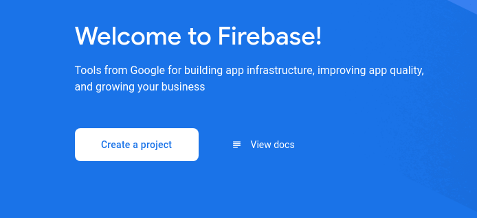
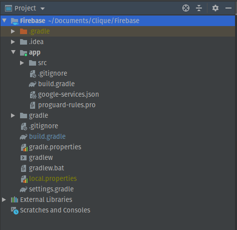
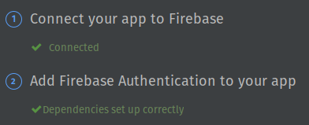

## Android Snippet
OTP verification with firebase

Language: Kotlin

---
### Pre-requisites
- Android Studio (latest version)
- Make sure that your project meets these requirements:
  - Targets API level 16 (Jelly Bean) or later
  - Uses Gradle 4.1 or later
  - Uses Jetpack (AndroidX), which includes meeting these version requirements:
    - com.android.tools.build:gradle v3.2.1 or later
    - compileSdkVersion 28 or later
- Set up a physical device or use an emulator to run your app.
- Sign into Firebase using your Google account.
### Set up firebase console
- Open [firebase console](https://console.firebase.google.com/u/0/) and create project. Before you can add Firebase to your Android app, you need to create a Firebase project to connect to your Android app.



---
- Select Android and click next
- Register your app. Registering your app is often called "adding" your app to your project.
- Add package name(this is available in the AndroidManifest.xml file in Android Studio), nickname of your project.
- Download the config file(google-services.json) and add it to your project in the app folder




- In your root-level (project-level) Gradle file (build.gradle), add rules to include the Google Services Gradle plugin.

```
buildscript {

  repositories {
    // Check that you have the following line (if not, add it):
    google()  // Google's Maven repository
  }

  dependencies {
    // ...

    // Add the following line:
    classpath 'com.google.gms:google-services:4.3.4'  // Google Services plugin
  }
}

allprojects {
  // ...

  repositories {
    // Check that you have the following line (if not, add it):
    google()  // Google's Maven repository
    // ...
  }
}
```
- In your module (app-level) Gradle file (usually app/build.gradle), apply the Google Services Gradle plugin:

```
apply plugin: 'com.android.application'
// Add the following line:
apply plugin: 'com.google.gms.google-services'  // Google Services plugin


android {
  // ...
}
```

- Add firebase SDKs to your app

```
dependencies {
  // ...

  // Import the Firebase BoM
  implementation platform('com.google.firebase:firebase-bom:25.12.0')

  // When using the BoM, you don't specify versions in Firebase library dependencies

  // Declare the dependency for the Firebase SDK for Google Analytics
  implementation 'com.google.firebase:firebase-analytics-ktx'

  // Declare the dependencies for any other desired Firebase products
  // For example, declare the dependencies for Firebase Authentication and Cloud Firestore
  implementation 'com.google.firebase:firebase-auth-ktx'
  implementation 'com.google.firebase:firebase-firestore-ktx'
}
```
- Sync your gradle file and you're well to go! :)
---
## Connecting to Firebase

- Goto Tools -> Firebase -> Authentication and connect to the firebase and add required dependencies 
- After successful connection, it will look something like this



---
**NOTE: Do not name your project firebase. It interferes with the dependencies**
