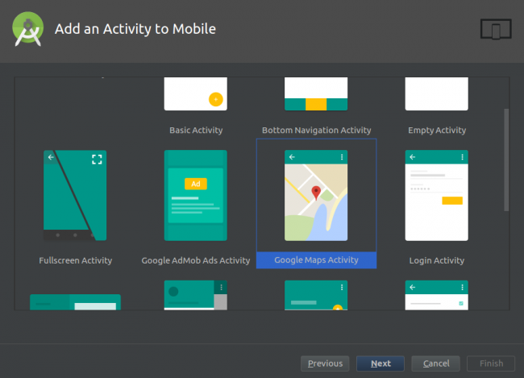
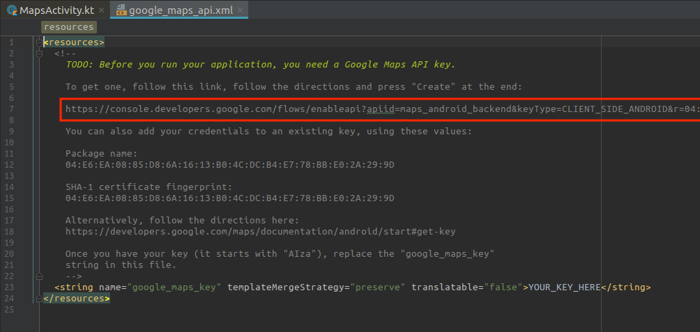
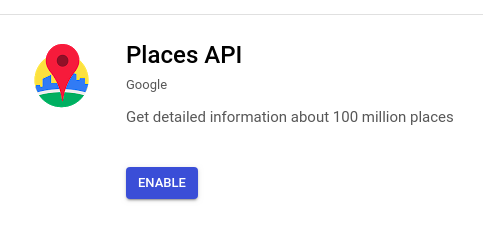

## Android Snippet
Google Maps API for Android
Language: Kotlin

---
### Pre-requisites
- Android Studio (latest version)
- Make sure that your project meets these requirements:
  - Targets API level 16 (Jelly Bean) or later
  - Uses Gradle 4.1 or later
  - Uses Jetpack (AndroidX), which includes meeting these version requirements:
    - com.android.tools.build:gradle v3.2.1 or later
    - compileSdkVersion 28 or later
- Set up a physical device or use an emulator to run your app.

#### **With this code snippet, yoou will be able to perform the following**
- Show a user’s current location
- Display and customize markers on a map
- Retrieve the address of a location given the coordinates
- Listen for location updates


---
### Creating the project

Create a new project in android and make sure you select google maps activity.




The template adds a Google Play Services dependency to **build.gradle**. This dependency exposes the Google Maps and Location Services APIs to the application.
```
implementation 'com.google.android.gms:play-services-maps:11.8.0'

```
_Make sure you have latest and compatible versions of google play services._

- In your module (app-level) Gradle file (usually app/build.gradle), apply the Google Services Gradle plugin:

```
apply plugin: 'com.android.application'
// Add the following line:
apply plugin: 'com.google.gms.google-services'  // Google Services plugin


android {
  // ...
}
```
### Creating API keys
- Open res/values/google_maps_api.xml. You will see the following:


- Open the link in your browser.
- On the Enable an API page, select Create a project and click Continue.
- On the next screen, click the Create API key button to continue.
- When that’s done, copy the API key shown in the API key created dialog and click Close.
- Head back to google_maps_api.xml, replace the value of **YOUR_KEY_HERE** key with the copied API key.
- Go back to the developer console and enable the Google Places API for Android.



Before adding any Kotlin code, you’ll need to configure Android Studio to automatically insert import statements to save you from having to add each one manually.

- Go to your Android Studio Preferences (or Settings on PC) and go to **Editor > General > Auto Import**, select the Add unambiguous imports on the fly and the **Show import** popup checkboxes, and click OK.
---
### Customization 

Download custom pins named ic_user_location from [this link](https://koenig-media.raywenderlich.com/uploads/2016/09/ic_user_location.zip) and unzip it. Switch to the Project view in the Project pane and copy all the files to the corresponding mipmap folders of the project.

The Android Maps API provides different map types to help you out:
 MAP_TYPE_NORMAL, MAP_TYPE_SATELLITE, MAP_TYPE_TERRAIN, MAP_TYPE_HYBRID
 
map.mapType = GoogleMap.MAP_TYPE_TERRAIN
