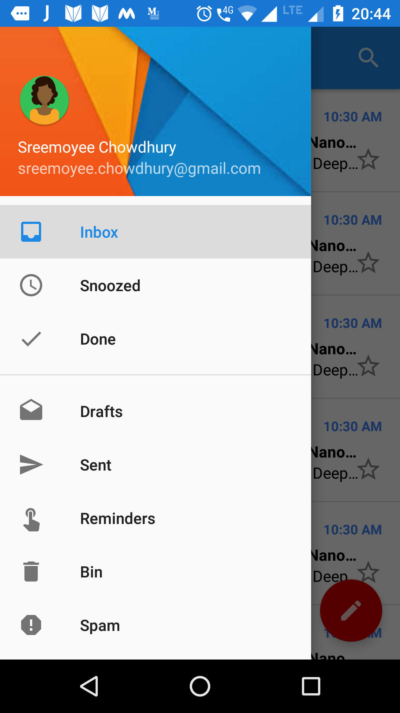
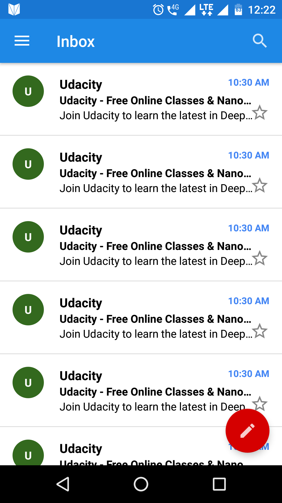
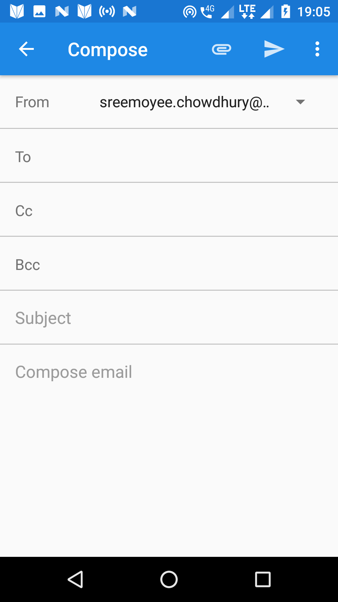
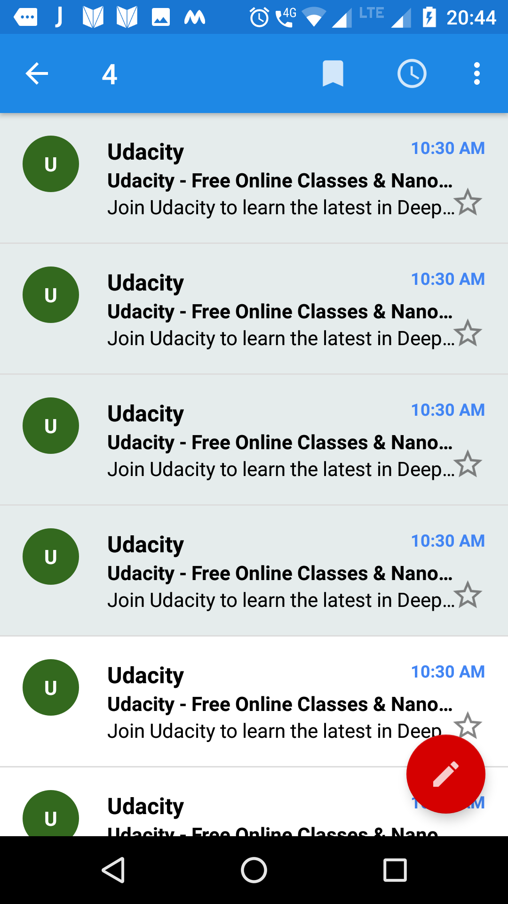
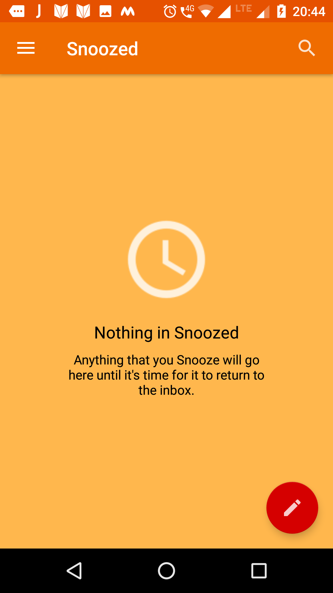
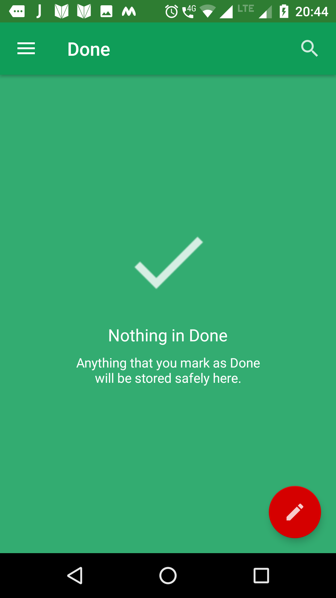
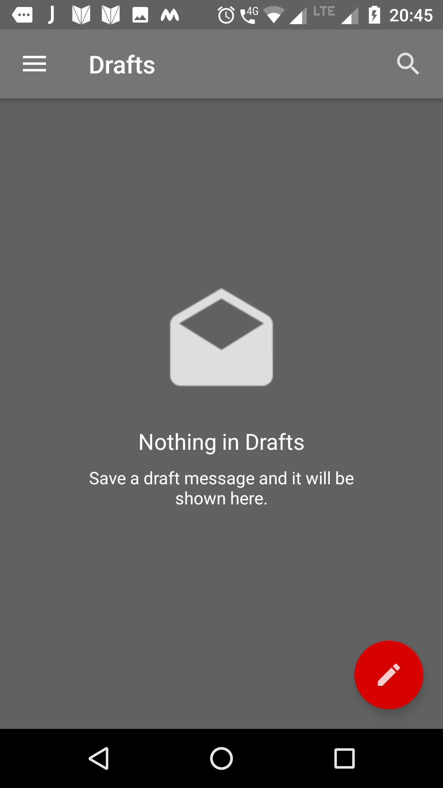

# Inbox-by-Gmail-Copy-Layout

This is the clone of the Inbox by Gmail app for the Google Udacity India Scholarship's Copy Layout Challenge. In this challenge we have to create an exact replica of some famous apps like Gmail, Whatsapp, Twitter, Instagram etc.

### Screenshots
 

 

